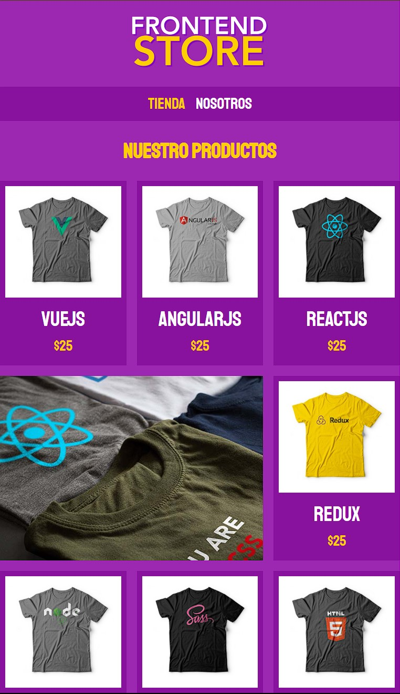

# Tienda-Online-Interface
Pequeño proyecto de interfaz para una tienda de ropa genérica. Desarrollado con HTML y CSS puro

## Tecnologías utilizadas
- **HTML5**: Estructura del contenido
- **CSS3**: Estilos y diseño responsivo

## Enlace
https://frontendstoreleonginel.netlify.app

## Capturas de Pantalla

